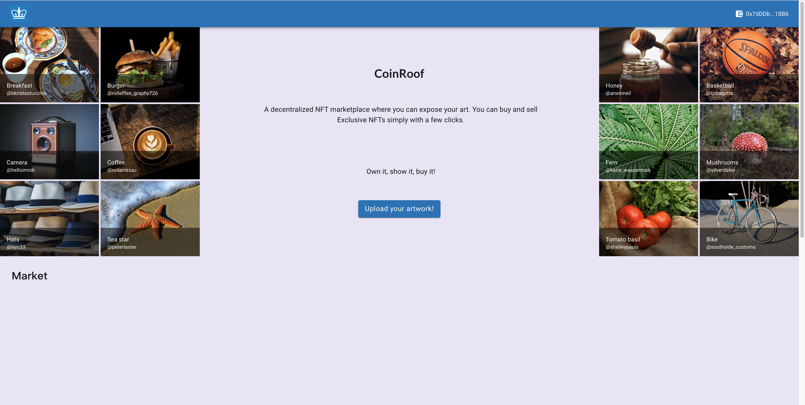
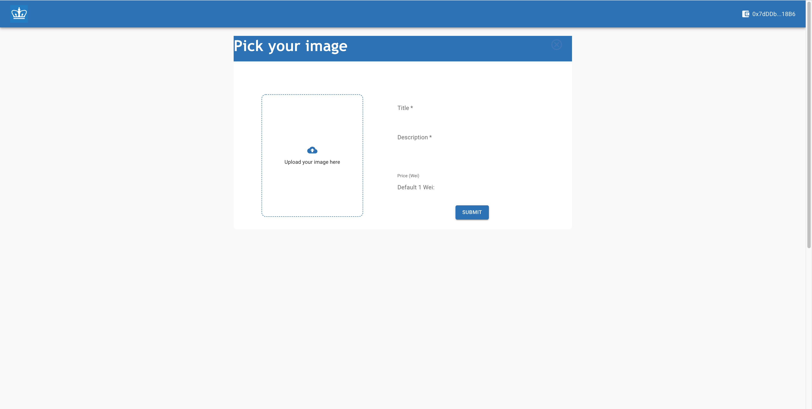
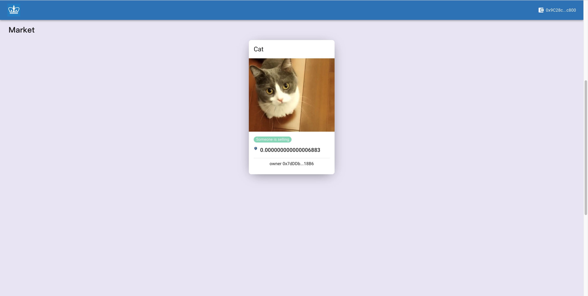
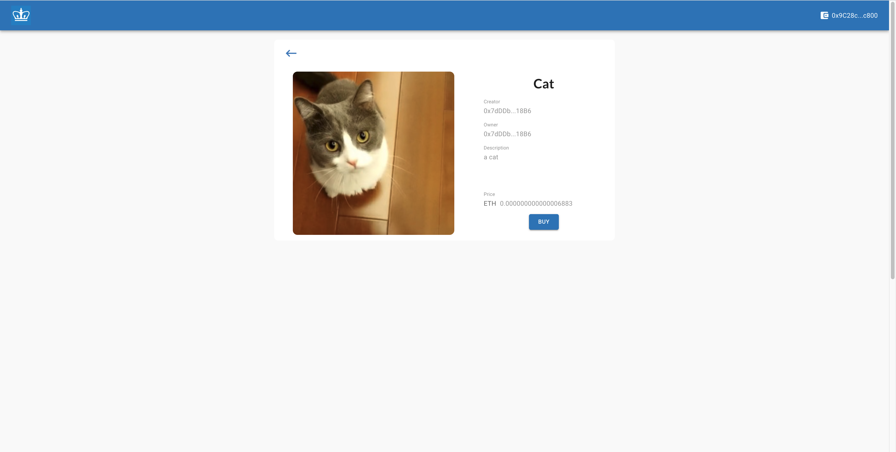
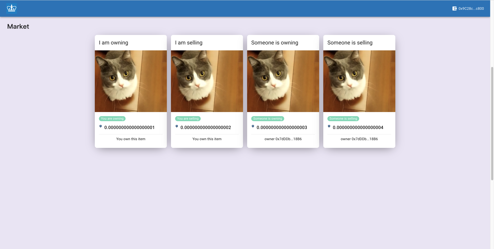

# CoinRoof: Market for NFT trading

Presented by:[Jiashu Chen](jc5664@columbia.edu), [Jing Peng](jp4801@columbia.edu), [Xiaoyue Chen](xc2551@columbia.edu), [Yang Yu](), [Yi Yang](yy3089@columbia.edu), [Zikai Zhu](zz2765@columbia.edu)

CoinRoof is a market place for users to trade their images as NFT.


## Install

### Dependencies

- [React](https://reactjs.org/)
- [Web3.js](https://web3js.readthedocs.io/en/v1.7.3/)
- [Ganache](https://trufflesuite.com/ganache/)
- [Truffle](https://trufflesuite.com/)
- [Solidity](https://docs.soliditylang.org/en/v0.8.13/)
- [MetaMask](https://metamask.io/) (Recommended)


### How to install

```shell
cd CoinRoof
yarn
```


## Start

First, start ganache through `ganache-cli` in the command line.

Then, use [start_client.sh](./start_client.sh) and [start_server.sh](./start_server.sh) to start the client and server of CoinRoof.

If you want to re-deploy your blockchain, use [redeploy.sh](./redeploy.sh).


## Deployment on CCN

To deploy our project on CCN, we need several changes in [truffle-config.js](./truffle-config.js). First, put your Alewallet private key into file [secrets.json](./secrets.json). Then in development, change the host to http://18.182.45.18 and port to 8765. Then, use `truffle migrate --network huygens` to deploy the project to CCN.


## Showcase

In our CoinRoof, you can upload your NFT to show, sell and buy NFTs.



### Upload your NFT

First, you can upload your images as NFTs to show them to all other users in this bloackchain:



After uploading your image as NFT, you can see it in the market. At this moment, you own the NFT but it is not on sale yet:


### Put your NFT on sale

If you want to sell your NFT, click on the NFT you own and then click on 'Sell' button:


Now, go back to the homepage, you will find that your NFT is on sale:


### Buy NFTs from other users in the blockchain

In the market, you can see all the NFTs. For those which are on sale, click them and you can see:





And now you are the owner of this NFT:


### All states

In our CoinRoof, we support four states for each NFT: You are owining, You are selling, Someone is owning and Someone is selling.



In CoinRoof, you can both show your NFTs and trading NFTs. Start it for fun!

## Reference

Nofer M, Gomber P, Hinz O, et al. Blockchain[J]. Business & Information Systems Engineering, 2017, 59(3): 183-187.

Dannen C. Introducing Ethereum and solidity[M]. Berkeley: Apress, 2017.

Wang Q, Li R, Wang Q, et al. Non-fungible token (NFT): Overview, evaluation, opportunities and challenges[J]. arXiv preprint arXiv:2105.07447, 2021.